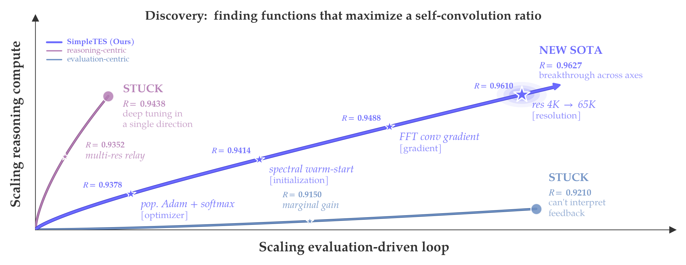

<div align="center">

# SimpleTES

**Evaluation-driven Scaling for Scientific Discovery**

Reference implementation behind the paper *Evaluation-driven Scaling for Scientific Discovery*.

SimpleTES is a training-free search system for open-ended problems where "reason longer" is not enough. It spends test-time compute on the loop that actually drives discovery: **propose -> evaluate -> refine**.

</div>

<p align="center">
  
</p>

## Why This Repo Exists

Most test-time scaling work spends extra compute on generation: more tokens, more samples, more turns. SimpleTES asks a different question:

> If progress depends on an external evaluator, how should we scale the evaluation-driven loop itself?

That framing matters for problems where the model cannot honestly know the answer without trying something in the world of the task: running code, checking a verifier, timing a kernel, compiling a circuit, fitting a law, or scoring a construction.

At a high level, SimpleTES allocates a fixed evaluator budget `N` across four levers:

| Lever | Meaning | Why it matters | Main CLI knob |
| --- | --- | --- | --- |
| `C` | Parallel exploration | Try genuinely different directions | `--num-chains` |
| `L` | Feedback-driven refinement depth | Let evaluator feedback compound | implied by total budget |
| `K` | Local best-of-`K` selection | Avoid committing weak candidates | `--k-candidates` |
| `Phi` | History-to-prompt policy | Decide what past evidence shapes the next attempt | `--selector` |

In rough terms, `N ~= C x L x K`.

The paper studies 21 featured problems across six domains and shows that this simple loop can discover state-of-the-art solutions with open-source `gpt-oss` models. This repository focuses on the **runtime system, task interface, benchmark assets, and released best artifacts** behind that work.

## If You Are Skimming

1. Use [`main_wizard.py`](main_wizard.py) if you want the fastest path to a first run.
2. Use [`main.py`](main.py) if you want scripted or cluster-friendly execution.
3. Read [`best_results/README.md`](best_results/README.md) if you want to inspect what the paper actually discovered.
4. Look at [`datasets/`](datasets) if you want to understand how tasks are packaged.
5. Read the "Bring Your Own Task" section below if you want to plug in your own evaluator.

## What You Get In This Repository

| Path | What it is | Why you care |
| --- | --- | --- |
| [`simpletes/`](simpletes) | Core engine, scheduler, policies, LLM backends, prompt templates | The actual search system |
| [`main.py`](main.py) | Primary CLI entry point | Best for reproducible runs and scripts |
| [`main_wizard.py`](main_wizard.py) | Interactive launcher | Best for exploring tasks and configs locally |
| [`datasets/`](datasets) | Built-in task families, evaluators, seeds, task assets | Where you run SimpleTES |
| [`best_results/`](best_results) | Highest-scoring released artifacts from the paper | Where you inspect final discoveries |
| [`scripts/`](scripts) | Task prep, plotting, stats extraction, registry helpers | Operational tooling around runs |
| [`tests/`](tests) | Regression tests | Sanity checks for the runtime |

Two important distinctions:

- [`datasets/`](datasets) is the **runnable benchmark tree**.
- [`best_results/`](best_results) is the **released artifact tree** for the paper's top results.

They are related, but they are not the same directory and do not serve the same purpose.

## Quickstart

### 1. Install

SimpleTES requires **Python >= 3.11**.

`uv` is the recommended workflow:

```bash
uv sync
uv sync --extra vllm   # optional: vLLM token-forcing backend
```

If you prefer `pip`:

```bash
pip install -e .
```

SimpleTES uses LiteLLM by default, so any LiteLLM-supported provider can work. Set the matching credential in your environment, for example:

```bash
export GEMINI_API_KEY=...
# or OPENAI_API_KEY / ANTHROPIC_API_KEY / ...
```

### 2. Fastest First Run

The easiest way to get oriented is the interactive launcher:

```bash
uv run python main_wizard.py
```

Useful wizard options:

- `--dry-run`: print the resolved `main.py` command without executing it
- `--save-profile <name>`: save the chosen configuration
- `--load-profile <name>`: replay a saved configuration
- `--list-profiles`: inspect saved launcher profiles

### 3. Direct CLI Example

This runs a small circle-packing search directly through `main.py`:

```bash
uv run python main.py \
  --init-program datasets/circle_packing/circle_packing_20/init_program.py \
  --evaluator datasets/circle_packing/circle_packing_20/evaluator.py \
  --instruction datasets/circle_packing/circle_packing_20/circle_packing_20.txt \
  --model gemini/gemini-2.0-flash \
  --max-generations 50 \
  --selector rpucg
```

Notes:

- `--selector rpucg` is a paper-style policy choice. The repository default is more conservative: `balance`.
- You can swap `--model` for any LiteLLM-supported model string.
- Checkpoints are written under `checkpoints/<date>/instance-<id>/`.

To resume a run:

```bash
uv run python main.py --resume checkpoints/<date>/instance-<id>
```

## A 30-Second Mental Model

Each trajectory in SimpleTES keeps a history of evaluated nodes:

- candidate solution
- scalar reward / score
- task-specific evaluator metadata

At every step, the system:

1. selects useful history from the trajectory,
2. builds the next prompt,
3. asks the model for one or more candidates,
4. evaluates them in isolated subprocesses,
5. commits the best one,
6. repeats until the evaluator budget is exhausted.

The runtime is asynchronous, so generation and evaluation can proceed concurrently with backpressure and checkpointing.

## Common Workflows

### Browse what policies exist

```bash
uv run python main.py --list-policies
```

### Check which tasks need setup

```bash
uv run python scripts/prepare_task.py --list
uv run python scripts/prepare_task.py --check
```

### Prepare a data-heavy family

```bash
uv run python scripts/prepare_task.py --task scaling_law
```

### Run tests

```bash
uv run pytest
```

### Override the evaluator environment

If a task family has its own virtual environment, SimpleTES will auto-detect `<task_family>/venv` when present. You can also pin one explicitly:

```bash
uv run python main.py ... --eval-venv path/to/venv
```

## Which Tasks Are Easy To Try First

For a first local run, start with self-contained families such as:

- `circle_packing`
- `autocorrelation`
- `erdos`
- `sums_diffs`

Families that usually need extra setup or external infrastructure include:

- `ahc` for AtCoder Heuristic Contest tasks
- `numerical_tasks`
- `open_problems_bio`
- `scaling_law`
- `znaa`

Other practical constraints:

- `ahc` evaluators use Docker.
- GPU-kernel tasks under [`datasets/gpumode/`](datasets/gpumode) and [`datasets/kernelbench/`](datasets/kernelbench) need suitable accelerator/runtime stacks.
- Different task families may rely on family-local assets, datasets, or environments.

## Benchmarks And Released Results

The repository contains two complementary views of the project:

- a **standard runnable task tree** under [`datasets/`](datasets)
- a **paper-featured artifact tree** under [`best_results/`](best_results)

The standard task tree currently exposes **35 launcher-discoverable subtasks across 11 families**, and the paper-featured artifact tree contains **21 released best-result packages across six domains**.

### Domain Coverage

| Domain | Runnable families / assets | Released best artifacts |
| --- | --- | --- |
| Quantum circuit compilation | [`datasets/qubit_routing/`](datasets/qubit_routing), [`datasets/znaa/`](datasets/znaa) | [`best_results/quantum_circuit_compilation/`](best_results/quantum_circuit_compilation) |
| GPU kernel optimization | [`datasets/gpumode/`](datasets/gpumode), [`datasets/kernelbench/`](datasets/kernelbench) | [`best_results/gpu_kernel_optimization/`](best_results/gpu_kernel_optimization) |
| Algorithm engineering | [`datasets/ahc/`](datasets/ahc), [`datasets/numerical_tasks/`](datasets/numerical_tasks) | [`best_results/algorithm_engineering/`](best_results/algorithm_engineering) |
| Mathematics extremal analysis | [`datasets/erdos/`](datasets/erdos), [`datasets/autocorrelation/`](datasets/autocorrelation) | [`best_results/mathematics_extremal_analysis/`](best_results/mathematics_extremal_analysis) |
| Combinatorial construction | [`datasets/circle_packing/`](datasets/circle_packing), [`datasets/sums_diffs/`](datasets/sums_diffs), [`datasets/hadamard_maximal_det/`](datasets/hadamard_maximal_det) | [`best_results/combinatorial_construction/`](best_results/combinatorial_construction) |
| Data science | [`datasets/scaling_law/`](datasets/scaling_law), [`datasets/open_problems_bio/`](datasets/open_problems_bio) | [`best_results/data_science/`](best_results/data_science) |

### Representative Discoveries From The Paper

SimpleTES is designed to be domain-general, not a one-off scaffold for a single benchmark. The released artifacts span:

- quantum routing and compilation policies that beat strong handcrafted baselines,
- GPU kernels for TriMul, batched cumsum, and asymmetric matrix multiplication,
- a LASSO path solver that outperforms expert baselines,
- new constructions for Erdos minimum overlap and autocorrelation inequalities,
- SOTA results on sum-difference, circle packing, and Hadamard determinant tasks,
- better scaling laws and a stronger single-cell RNA denoising pipeline.

If you want to inspect the exact paper artifacts, start with [`best_results/README.md`](best_results/README.md).

## How The Search Budget Maps To Flags

If you want to tune the system without reading the entire codebase, these are the knobs that matter most:

| Goal | Main flags | Practical interpretation |
| --- | --- | --- |
| Increase total search budget | `--max-generations` | More evaluator calls overall |
| Explore more directions | `--num-chains` | More independent trajectories |
| Make each step less myopic | `--k-candidates` | Evaluate several local candidates before committing |
| Change how history is used | `--selector` | Swap prompt-construction / selection policy |
| Match runtime to infra | `--gen-concurrency`, `--eval-concurrency` | Separate model throughput from evaluator throughput |

Selector notes:

- `balance`: repository default, simple and robust
- `puct`: tree-search flavored selection
- `rpucg`: stronger paper-style selector with DAG-aware value propagation
- `llm_puct`, `llm_rpucg`, `llm_elite`: selectors that add an LLM-guided policy layer

For the full surface area, run:

```bash
uv run python main.py --help
```

## Bring Your Own Task

The minimal SimpleTES task contract is intentionally small. A standard task directory looks like:

```text
my_family/
  my_task/
    init_program.py
    evaluator.py
    my_task.txt
```

What each file does:

- `init_program.py`: the seed solution or baseline the search starts from
- `evaluator.py`: scores a candidate and returns at least `{"combined_score": float, ...}`
- `my_task.txt`: the instruction shown to the model

SimpleTES is not limited to Python-only outputs. Built-in tasks also evolve:

- C++ programs
- Rust programs
- mathematical constructions stored as JSON artifacts

The most important evaluator contract is:

```python
def evaluate(candidate_path: str) -> dict:
    return {
        "combined_score": 0.0,
        # any additional task-specific metadata
    }
```

Practical tips:

- If your task needs extra Python packages, ship a family-local environment and/or lockfile.
- If your task needs large assets, declare them with a `data_manifest.json` and use [`scripts/prepare_task.py`](scripts/prepare_task.py).
- If you want the interactive launcher to discover the task automatically, follow the standard `init_program + evaluator + *.txt` layout.

## Repository Tour

```text
main.py                  primary CLI for scripted runs
main_wizard.py           interactive launcher
simpletes/               engine, policies, scheduler, LLM adapters, templates
datasets/                runnable task families and supporting assets
best_results/            released top artifacts from the paper
scripts/                 setup, plotting, extraction, registry helpers
tests/                   regression tests
picture/                 README and branding images
```

## Troubleshooting

- `LLM preflight failed`: check your provider credentials, model string, or API base. Use `--skip-preflight` only if you know your backend is still starting.
- `No checkpoints found` on resume: pass the instance directory itself, not its parent directory.
- A task complains about missing files: run `uv run python scripts/prepare_task.py --list` and prepare the relevant family.
- Evaluations fail because of missing packages: provide or point to the correct task-local environment with `--eval-venv`.
- You are hitting rate limits: lower `--gen-concurrency`, raise `--retry`, or move to a lower-latency model.
- Evaluations time out: raise `--eval-timeout` for slow compilers, simulators, or long-running tasks.

## Scope Note

The accompanying paper also studies learning from successful discovery trajectories. This repository is centered on the **search/runtime side** of SimpleTES: generation, evaluation, scheduling, selectors, task packaging, and released result artifacts.

## License

SimpleTES is released under [GNU AGPL-3.0-or-later](LICENSE), Copyright (C) 2026 WILL.

Practical summary:

- Research and local use are allowed.
- If you modify the framework and distribute it, the derivative framework remains AGPL.
- If you expose a modified version as a network service, you must provide source under AGPL terms.
- Programs discovered by SimpleTES are not themselves automatically bound by AGPL just because SimpleTES found them.

<p align="center">
  
</p>
