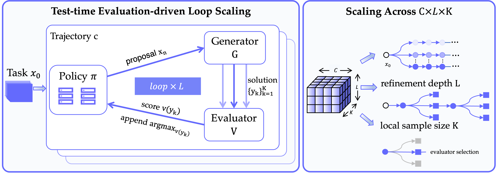

<p align="center">
  
</p>

<h1 align="center">SimpleTES</h1>

<p align="center">
  <b>Test-time compute, spent where it actually matters.</b>
</p>

<!-- A1: project meta badges -->
<p align="center">
  <a href="https://www.wizardquant.com/will/simpletes"></a>
  <a href="https://arxiv.org/abs/2604.19341"></a>
  <a href="LICENSE"></a>
  <a href="https://github.com/wq-will/SimpleTES/stargazers"></a>
  <a href="https://github.com/wq-will/SimpleTES/issues"></a>
</p>

<!-- Hero diagram -->
<p align="center">
  
</p>

**SimpleTES** (Simple Test-time Evaluation-driven Scaling) scales the propose → evaluate → refine loop for scientific discovery. It combines parallel exploration, feedback-driven refinement, and local selection. Open-source `gpt-oss` models reach state-of-the-art on 21 problems across six domains, beating both frontier models and tuned optimization pipelines.

## Updates

- **2026-04** — Released the [SimpleTES technical report on arXiv](https://arxiv.org/abs/2604.19341) and the public codebase.

## Highlight Results

| Domain | Highlights | Artifacts |
|--------|------------|-----------|
| Quantum circuit compilation | Routing policies beating strong handcrafted baselines on SABRE / QASMBench | [`best_results/quantum_circuit_compilation/`](best_results/quantum_circuit_compilation) |
| GPU kernel optimization | TriMul, batched cumsum, asymmetric matmul kernels | [`best_results/gpu_kernel_optimization/`](best_results/gpu_kernel_optimization) |
| Algorithm engineering | LASSO path solver out-performing expert baselines (2× speedup) | [`best_results/algorithm_engineering/`](best_results/algorithm_engineering) |
| Mathematics — extremal analysis | New Erdős min-overlap & autocorrelation constructions | [`best_results/mathematics_extremal_analysis/`](best_results/mathematics_extremal_analysis) |
| Combinatorial construction | SOTA sum-difference, circle packing, Hadamard determinant | [`best_results/combinatorial_construction/`](best_results/combinatorial_construction) |
| Data science | Better scaling laws & single-cell RNA denoising | [`best_results/data_science/`](best_results/data_science) |

- Full inventory of all 21 released artifacts: [`best_results/README.md`](best_results/README.md).
- **Case studies** — what each task's seed program evolved into, with side-by-side animations: [`assets/case_study/README.md`](assets/case_study/README.md).

## How It Works

A fixed evaluator budget is spent across four levers:

| Lever | Knob | Controls |
|:-----:|------|----------|
| **`C`** | `--num-chains` | Parallel exploration — try genuinely different directions |
| **`L`** | implied by total budget | Feedback-driven refinement depth per chain |
| **`K`** | `--k-candidates` | Local best-of-`K` — avoid committing weak candidates |
| **`Φ`** | `--selector` | History-to-prompt policy — what past evidence shapes the next attempt |

Each trajectory keeps a history of `(candidate, score, metadata)`. One step: select history, build prompt, ask for `K` candidates, evaluate in isolated subprocesses, commit the best.

**Available selectors** (`uv run python main.py --list-policies`):

| Selector | Style | Best for |
|----------|-------|----------|
| `balance` *(default)* | Stratified sampling | Robust default; low-config exploration |
| `puct` | PUCT scoring | Tree-search flavored selection |
| `rpucg` | DAG-aware, γ-decay | Paper-style; strongest single selector |
| `llm_elite` | Bounded elite pool | LLM-managed per-chain population |
| `llm_puct` / `llm_rpucg` | Hybrid prefilter + LLM | Best for noisy chains / rich DAG histories |

## Quickstart

Python ≥ 3.11. Install with `uv`:

```bash
uv sync
uv sync --extra vllm        # optional: vLLM token-forcing backend
```

Or `pip install -e .`.

Set credentials for any [LiteLLM-supported](https://docs.litellm.ai/docs/providers) provider:

```bash
export GEMINI_API_KEY=...      # or OPENAI_API_KEY / ANTHROPIC_API_KEY / ...
```

Interactive launcher (discovers tasks, prompts for model / budget / selector, prints or runs the command):

```bash
uv run python main_wizard.py
```

Direct CLI:

```bash
uv run python main.py \
  --init-program  datasets/circle_packing/circle_packing_26/init_program.py \
  --evaluator     datasets/circle_packing/circle_packing_26/evaluator.py \
  --instruction   datasets/circle_packing/circle_packing_26/circle_packing_26.txt \
  --model         gemini/gemini-2.0-flash \
  --selector      rpucg \
  --max-generations 50
```

Resume from an instance directory:

```bash
uv run python main.py --resume checkpoints/<date>/instance-<id>
```

All flags: `uv run python main.py --help`.

## Configuration

<details>
<summary><b>📋 Most-tuned flags</b> — click to expand</summary>

| Goal | Flag |
|------|------|
| Total search budget | `--max-generations` |
| More directions | `--num-chains` |
| Less myopic local picks | `--k-candidates` |
| Change history-to-prompt strategy | `--selector` |
| Per-chain in-flight cap (concurrency) | `--backpressure-multiplier` |
| Split throughput knobs | `--gen-concurrency`, `--eval-concurrency` |
| Early stop when score reached | `--early-stop-score` |
| Inspirations per prompt (or a sampled range) | `--num-inspirations` / `--min-inspirations-cnt` / `--max-inspirations-cnt` |
| Switch LLM backend | `--llm-backend litellm` (default) or `--llm-backend vllm_token_forcing` |
| Use a task-local Python env | `--eval-venv <path>` (auto-detected for `datasets/<family>/venv/`) |
| Skip the 1-token LLM ping at startup | `--skip-preflight` |

</details>

<details>
<summary><b>🎚️ Selector-specific flags</b> — click to expand</summary>

| Selector | Flag |
|----------|------|
| `balance` | `--exploitation-ratio` / `--exploration-ratio` / `--elite-ratio` |
| `puct` | `--puct-c` |
| `rpucg` | `--rpucg-gamma` |
| `llm_elite` / `llm_puct` / `llm_rpucg` | `--llm-policy-model` / `--llm-policy-api-base` / `--llm-policy-api-key` / `--llm-policy-pool-size` |

</details>

<details>
<summary><b>💾 Checkpoint & resume</b> — click to expand</summary>

Checkpoints land under `--output-path` (default `checkpoints/`) every `--log-interval` evaluations. Each run gets a `<date>/instance-<id>/` directory. Resume with `--resume` pointed at that instance directory:

```bash
uv run python main.py --resume checkpoints/<date>/instance-<id>
```

`--save-llm-io` keeps full LLM input/output (large files). `--gzip` compresses checkpoint nodes.

</details>

## Build Your Own Task

SimpleTES ships with 13 task families across 6 domains. A new task is three files:

```text
my_family/
  my_task/
    init_program.{py|cpp|rs|...}      # seed; mark the evolved region with EVOLVE-BLOCK
    evaluator.py                      # def evaluate(filepath) -> {"combined_score": ..., ...}
    my_task.txt                       # instruction shown to the model
```

Drop the directory under `datasets/` and `main_wizard.py` picks it up.

→ Catalogue + design guide: [`datasets/README.md`](datasets/README.md).

## Contributing

Contributions are welcome.

- **New tasks**: follow [`datasets/README.md`](datasets/README.md#how-to-design-your-own-task) and open a PR.
- **Code**: fork, add tests under [`tests/`](tests), run `uv run pytest`, open a PR with a benchmark comparison.
- **Bugs / features**: [GitHub Issues](https://github.com/wq-will/SimpleTES/issues).

<p align="center">
  [<a href="https://github.com/wq-will/SimpleTES/issues/new?labels=bug">Report a Bug</a>]
  | [<a href="https://github.com/wq-will/SimpleTES/issues/new?labels=enhancement">Suggest a Feature</a>]
  | [<a href="https://github.com/wq-will/SimpleTES/pulls">Open a PR</a>]
  | [<a href="datasets/README.md#how-to-design-your-own-task">Add a Task</a>]
</p>

## Troubleshooting

<details>
<summary>The most common issues and how to resolve them are listed below.</summary>

| Symptom | Action |
|---------|--------|
| **`LLM preflight failed`** | Check provider credentials, model string, and API base. Use `--skip-preflight` to bypass while the backend is still warming up. |
| **`No checkpoints found` on resume** | Pass the **instance** directory (e.g. `checkpoints/2026-05-24/instance-0`), not its parent date directory. |
| **Task complains about missing files** | `uv run python scripts/prepare_task.py --list` to see what's available, then `--task <family>` to fetch / build. |
| **Evaluations error on imports** | Pin the task-local venv with `--eval-venv <path>`; SimpleTES auto-detects `datasets/<family>/venv/` when present. |
| **Hitting rate limits** | Lower `--gen-concurrency`, raise `--retry`, or switch to a lower-latency model. |
| **Evaluations time out** | Raise `--eval-timeout` for slow compilers / simulators. The task-level default lives in each evaluator as `TIMEOUT_SECONDS` and can be overridden per-evaluation via `EVALUATOR_TIMEOUT_SECONDS`. |
| **GPU-kernel tasks (`gpumode`, `kernelbench`) hang** | Make sure the compiler server is running first — see the family `README.md` for the launch command. |
| **`fcntl` import error** (Windows) | The registry script `scripts/evolve_db_registry.py` is POSIX-only by design. Other tasks run fine on Windows. |

</details>

## Community

Join the SimpleTES community to discuss usage, share research progress, and send feedback. Scan the QR code below to join the chat group:

<p align="center">
  
</p>

## Citation

```bibtex
@article{simpletes2026,
  title   = {Evaluation-driven Scaling for Scientific Discovery},
  author  = {WILL Team},
  journal = {arXiv preprint arXiv:2604.19341},
  year    = {2026},
  url     = {https://arxiv.org/abs/2604.19341}
}
```

## License

Released under [GNU AGPL-3.0-or-later](LICENSE), © 2026 WILL.

- Research and local use — allowed.
- Programs *discovered* by SimpleTES — not automatically AGPL just because SimpleTES found them.
- Modifying the framework and **distributing** it — the derivative framework stays AGPL.
- Exposing a modified version as a **network service** — you must provide source under AGPL terms.

<p align="center">
  
</p>
