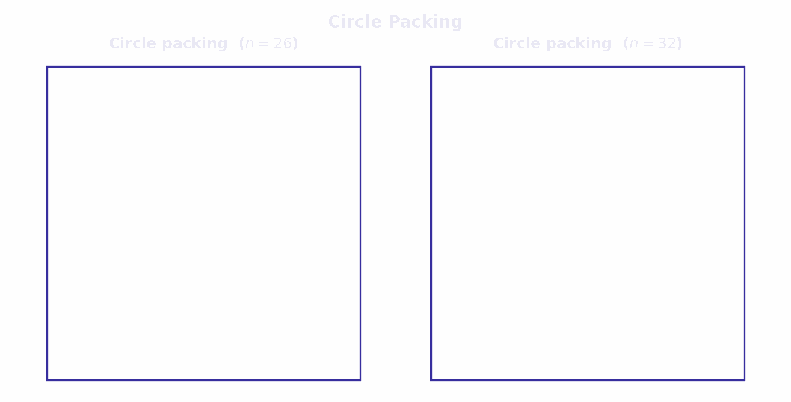
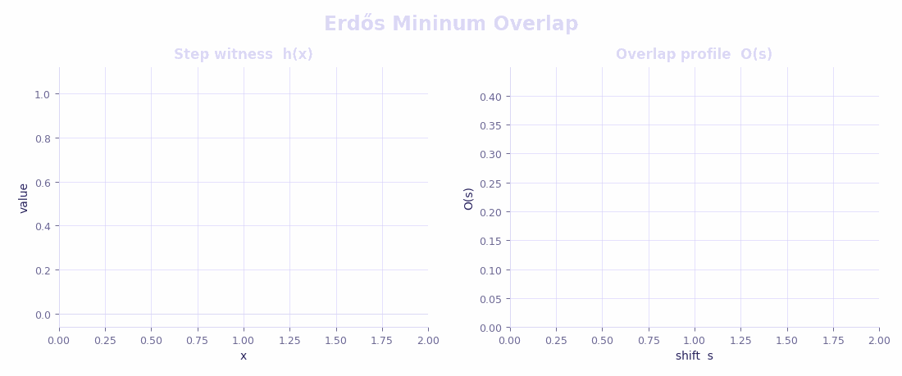
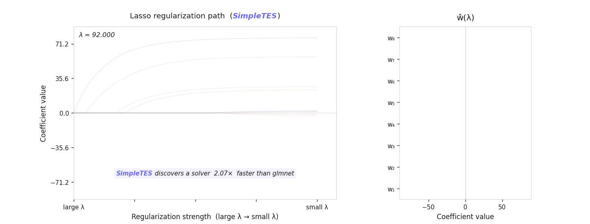
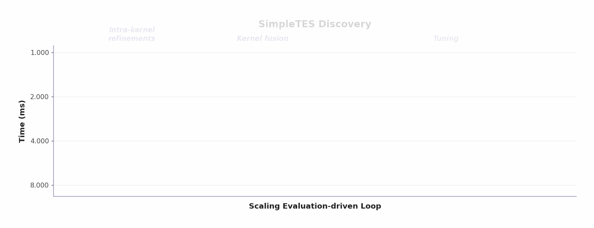
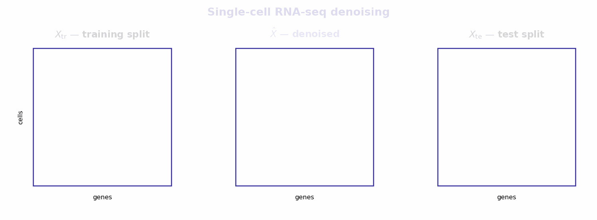

# Case Studies

Side-by-side animations of how the seed `init_program.py` evolves into the released best result for six tasks. Seeds are weak baselines (grids, random noise, textbook implementations); the released versions live under [`best_results/`](../../best_results).

Jump to: [Circle Packing](#1-circle-packing) · [Hadamard 29](#2-hadamard-maximum-determinant-n--29) · [Erdős](#3-erdős-minimum-overlap) · [LASSO Path](#4-lasso-regularisation-path) · [TriMul](#5-trimul-gpu-kernel) · [scRNA-seq Denoising](#6-single-cell-rna-seq-denoising)

---

## 1. Circle Packing

Domain: combinatorial construction. Task family: [`circle_packing`](../../datasets/circle_packing).

  

Pack `n` non-overlapping circles in the unit square to maximise the sum of radii. Released for `n = 26` and `n = 32`.

- **Seed**: uniform grid of equal-radius circles, then shrinks each radius to the minimum centre-to-centre distance.
- **Evolved**: LP feasibility check over a pre-computed pair-constraint matrix, then `scipy.optimize.differential_evolution` over the placement, with `cvxpy` polishing radii at each candidate.
- **Result**: matches or exceeds public baselines on both n. Side-by-side plot in [`best_results/mathematics_discovery/circle_packing_in_a_unit_square_n26/`](../../best_results/mathematics_discovery/circle_packing_in_a_unit_square_n26).

---

## 2. Hadamard Maximum Determinant (n = 29)

Domain: combinatorial construction. Task family: [`hadamard_maximal_det`](../../datasets/hadamard_maximal_det).

  

Find a 29 × 29 ±1 matrix maximising `|det(H)|`. Score is `|det(H)| / 29^(29/2)`.

- **Seed**: ad-hoc ±1 matrix with exact integer determinant via Bareiss. No structure.
- **Evolved**: warm-starts from a Paley (quadratic-residue circulant) construction, then refines via local sign flips guided by `logabs_det`.
- **Result**: visible in the GIF — baseline has banded structure, SimpleTES matrix is the noise-like high-determinant pattern.

---

## 3. Erdős Minimum Overlap

Domain: mathematics — extremal analysis. Task family: [`erdos`](../../datasets/erdos).

  

Find a step function `h: [0, 2] → [0, 1]` with `∑h = n/2` that minimises `Ψ(h) = max_s ∫ h(x)·(1 − h(x+s)) dx`.

- **Seed**: `h ≡ 0.5` plus zero-mean random noise in `[-0.4, 0.4]`.
- **Evolved**: seven-stage pipeline — warm-start from Paley, stochastic donor-receiver swaps, Adam on a smooth-max surrogate, guided swaps at the worst shift, binary rounding, binary best-swap, simulated annealing.
- **Result**: `Ψ(h) = 0.380868`.

---

## 4. LASSO Regularisation Path

Domain: algorithm engineering. Task family: [`numerical_tasks`](../../datasets/numerical_tasks).

  

Solve the full path `min ½n·‖y − Xw‖² + λ·‖w‖₁` over a decreasing λ schedule, matching `sklearn.lasso_path` within `1e-6` in float64. Score is `1 / geomean(wall_time)`.

- **Seed**: textbook C++ coordinate descent with `Eigen`. Single soft-threshold, naïve outer loop, no parallelism.
- **Evolved**: tuned CD with OpenMP, hot/cold variable partitioning across the λ schedule, cache-resident residual updates.
- **Result**: **2.17× faster than `glmnet`** at matched precision.

---

## 5. TriMul GPU Kernel

Domain: GPU kernel optimization. Task family: [`gpumode`](../../datasets/gpumode).

  

Implement the TriMul block (triangular matmul with gating and layernorm) matching the PyTorch reference within `2e-2`. The kernel is discovered on H200 and evaluated without re-tuning on H100 and other accelerators.

- **Seed**: `torch.nn` with `einsum` and `nn.Linear`. Reference semantics, no GPU tuning.
- **Evolved**: hand-written Triton in four stages — FP16 compute / FP32 accumulate, concat-weight single GEMM, fused layernorm + gate + projection, full autotune with adaptive `num_warps`.
- **Result**: **1.122 ms on H100** and **1.020 ms on H200**.

---

## 6. Single-cell RNA-seq Denoising

Domain: data science. Task family: [`open_problems_bio`](../../datasets/open_problems_bio).

  

Given a sparse UMI count matrix `X_train` (cells × genes), produce a denoised `X̂` that minimises reconstruction error on a held-out `X_test` from the same pancreas dataset.

- **Seed**: stock MAGIC — k-NN graph, `t` diffusion steps on the graph operator.
- **Evolved**: truncated SVD + NMF for the low-rank backbone, `NearestNeighbors` for local smoothing, optional MAGIC pass behind a flag. Components combined by weights tuned on the held-out loss.
- **Result**: improves on the MAGIC baseline on the bundled pancreas split; matches the released paper best.

---

Each evolved program is in [`best_results/<domain>/<task>/<task>_best.py`](../../best_results). Each seed is in [`datasets/<family>/<subtask>/init_program.py`](../../datasets). To reproduce, run `main.py` on the same seed — see the [top-level Quickstart](../../README.md#installation--quickstart).
